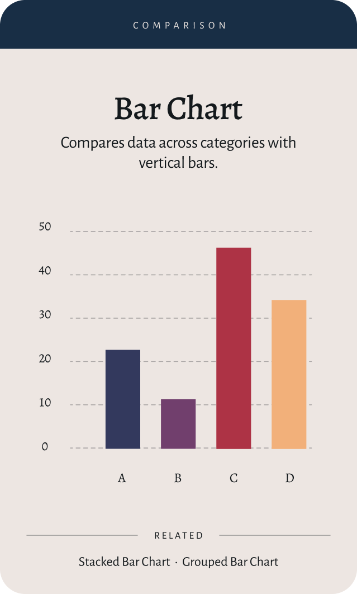

# Bar Chart

A bar chart is a graphical representation of data that uses rectangular bars to show comparisons between categories.
This composable allows for customization of the bar chart's appearance and behavior.

## Usage

```kotlin
BarChart(
    data = {
        listOf(
            BarData("Jan", 100f),
            BarData("Feb", 150f),
            BarData("Mar", 120f)
        )
    },
    color = ChartyColor.Solid(ChartyColors.Blue),
    barConfig = BarChartConfig(
        barWidthFraction = 0.6f,
        roundedTopCorners = true,
        topCornerRadius = CornerRadius.Large,
        animation = Animation.Enabled()
    )
)
```

## Configuration

### [BarChartConfig](#bar-chart-config)

See [BarChartConfig](#bar-chart-config) for detailed configuration options.

### [ChartScaffoldConfig](#chart-scaffold-config)

See [ChartScaffoldConfig](#chart-scaffold-config) for detailed scaffold configuration options.
