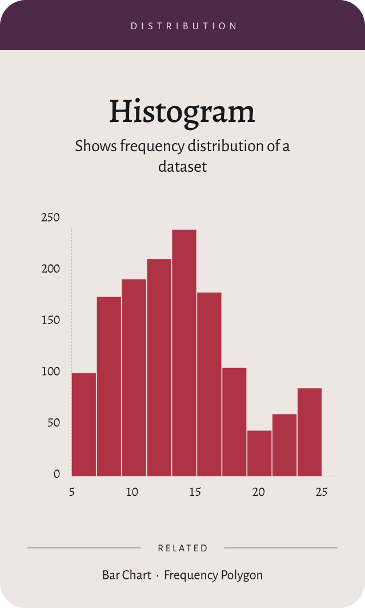

# Bar Charts Overview

Bar charts are one of the most common ways to compare categorical data using the length of rectangular bars.
Charty provides several bar-chart variants for different comparison and composition needs.

## Preview

## When to use bar charts

- You need to compare values across discrete categories (products, regions, segments).
- You want a clear ranking of categories from highest to lowest.
- You have relatively few categories and want a compact, readable visualization.
- You want to show composition or change across categories using stacked or waterfall variants.

## Bar chart variants

Charty includes a range of bar-style charts. Use these dedicated pages for details, configuration, and examples:

- [Bar Chart](bar-chart.md)
- [Horizontal Bar Chart](horizontal-bar-chart.md)
- [Stacked Bar Chart](stacked-bar-chart.md)
- [Mosiac Bar Chart](mosiac-bar-chart.md)
- [Comparison Bar Chart](comparison-bar-chart.md)
- [Bubble Bar Chart](bubble-bar-chart.md)
- [Lollipop Bar Chart](lollipop-bar-chart.md)
- [Span Chart](span-chart.md)
- [Waterfall Chart](waterfall-chart.md)
- [Wavy Chart](wavy-chart.md)
- [Block Bar Chart](block-bar-chart.md)
- [Combo Bar Chart](combo-bar-chart.md)

## Choosing a bar chart type

- Use a **Bar Chart** for simple comparisons between categories.
- Use a **Horizontal Bar Chart** when you have long labels or many categories.
- Use a **Stacked Bar Chart** to show part-to-whole composition over categories.
- Use a **Mosiac Bar Chart** when all bars should represent 100% and emphasize proportions.
- Use a **Comparison Bar Chart** for grouped bars comparing multiple series side-by-side.
- Use a **Bubble or Lollipop Bar Chart** for more playful or lightweight visual styles.
- Use a **Span Chart** for time ranges or intervals, similar to a lightweight Gantt chart.
- Use a **Waterfall Chart** for cumulative effects of sequential gains and losses.
- Use a **Combo Bar Chart** when you want both bars and a line in the same view.

## Related chart families

- [Line Charts](line-charts.md)  time-series and trend visualizations.
- [Pie Charts](pie-charts.md)  part-to-whole composition for a small number of categories.
