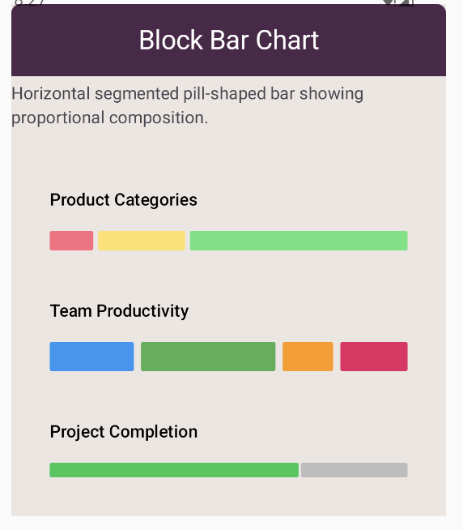

# Block Bar Chart
- [Bar Charts Overview](bar-charts.md)
- [Mosiac Bar Chart](mosiac-bar-chart.md)
- [Bubble Bar Chart](bubble-bar-chart.md)
- [Bar Chart](bar-chart.md)

## Related charts

- Use animations to show blocks "building up" for engaging presentations.
- Add value labels showing the exact count for precision.
- Consider color-coding blocks by status (e.g., completed vs. in-progress).
- Use consistent block sizes across all categories for fair comparison.
- Keep block counts reasonable (under 30 per column) to maintain readability.

## Tips

```
)
    ),
        blockSpacing = 2.dp,
        blockSize = 10.dp,
    blockConfig = BlockBarChartConfig(
    ),
        listOf(Color(0xFF4CAF50), Color(0xFF8BC34A), Color(0xFFCDDC39))
    color = ChartyColor.Gradient(
    data = { taskCompletionData },
BlockBarChart(
```kotlin

### Multi-color blocks

```
)
    ),
        maxBlocks = 20,
        blockSpacing = 4.dp,
        blockSize = 12.dp,
    blockConfig = BlockBarChartConfig(
    color = ChartyColor.Solid(Color(0xFF2196F3)),
    },
        )
            BarData("Team C", 9f),
            BarData("Team B", 18f),
            BarData("Team A", 12f),
        listOf(
    data = {
BlockBarChart(
```kotlin

## Code examples

- [Chart scaffold configuration](../configurations/chart-scaffold-config.md)
- [Bar chart configuration](../configurations/bar-chart-config.md)

See also:

- Colors: Use solid colors, gradients, or per-block color variations.
- `maxBlocks`: Limits the maximum number of blocks shown per category.
- `blocksPerRow`: Arranges blocks in a grid pattern within each column (optional).
- `blockSpacing`: Controls the gap between stacked blocks.
- `blockSize`: Sets the width and height of individual blocks.

Key options include:

Block bar charts use configuration options specific to block size, spacing, and coloring.

## Configuration

- Representing quantized data where individual units are meaningful (e.g., people, devices, packages).
- Creating playful, tactile visualizations for consumer-facing dashboards.
- Showing progress or completion status in "units" rather than continuous bars.
- Visualizing discrete counts such as tasks completed, units sold, or items in inventory.

## Use cases



## Preview

feel that's particularly effective for showing discrete quantities like completed tasks or inventory items.
where each block represents a fixed unit or count. This provides a tangible, "building-block"
A block bar chart visualizes data as stacked discrete blocks within vertical columns,


