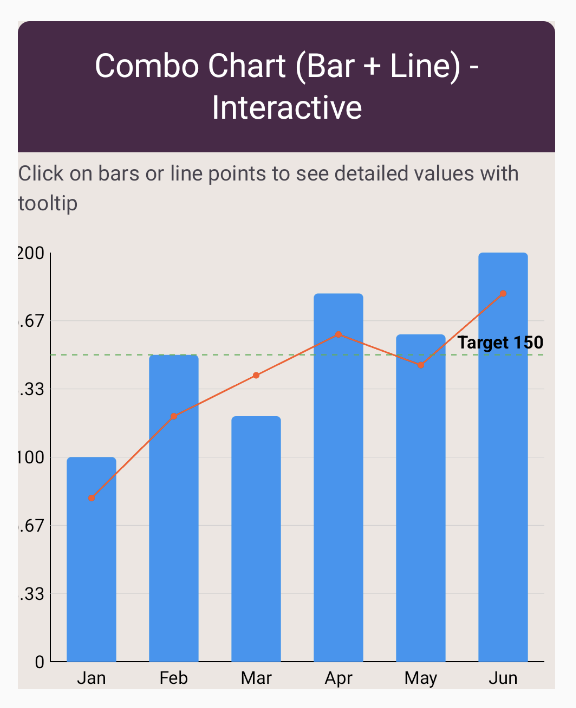

# Combo Bar Chart

A combo bar chart (also called a combination or mixed chart) displays bars and lines together on the same chart,
allowing you to compare different types of data or show relationships between volume and trends.
This is ideal when you need to show both categorical comparisons (bars) and continuous trends (lines).

## Preview



## Use cases

- Displaying bars for actual values and a line for targets or benchmarks.
- Showing volume (bars) alongside trends or moving averages (line).
- Comparing absolute values (bars) with percentages or rates (line).
- Presenting sales figures (bars) with cumulative totals (line).

## Configuration

Combo bar charts require configuration for both bar and line components, often using dual axes.

Key options include:

- Bar configuration: `barWidthFraction`, corner radius, colors for bars.
- Line configuration: Line thickness, point markers, smoothing for the line series.
- Dual axes: Optionally use separate Y-axes for bars and lines if scales differ significantly.
- Colors: Use distinct colors to differentiate bars from lines.
- Legends: Clearly label which series is which.

See also:

- [Bar chart configuration](../configurations/bar-chart-config.md)
- [Chart scaffold configuration](../configurations/chart-scaffold-config.md)

## Code examples

```kotlin
ComboBarChart(
    barData = {
        listOf(
            BarData("Jan", 100f),
            BarData("Feb", 150f),
            BarData("Mar", 120f),
            BarData("Apr", 180f),
        )
    },
    lineData = {
        listOf(
            LineData("Jan", 110f),
            LineData("Feb", 140f),
            LineData("Mar", 130f),
            LineData("Apr", 170f),
        )
    },
    barColor = ChartyColor.Solid(Color(0xFF2196F3)),
    lineColor = ChartyColor.Solid(Color(0xFFE91E63)),
    comboConfig = ComboChartConfig(
        barWidthFraction = 0.6f,
        lineThickness = 3.dp,
        showLinePoints = true,
    ),
)
```

### Actual vs. Target example

```kotlin
ComboBarChart(
    barData = { actualSales },
    lineData = { targetSales },
    barColor = ChartyColor.Solid(Color(0xFF4CAF50)),
    lineColor = ChartyColor.Solid(Color(0xFFFF9800)),
    comboConfig = ComboChartConfig(
        barWidthFraction = 0.7f,
        lineThickness = 2.dp,
        showLinePoints = false,
        dualAxes = false,
    ),
)
```

## Tips

- Use contrasting colors for bars and lines to make them easily distinguishable.
- Add a clear legend identifying what the bars and lines represent.
- Consider using dual Y-axes if bar and line values have very different scales.
- Limit to one or two lines to avoid visual clutter; use **Comparison Bar Chart** for multiple bar series.
- Ensure the line stands out visually (thicker stroke or point markers) so it's not lost behind bars.

## Related charts

- [Bar Chart](bar-chart.md)
- [Comparison Bar Chart](comparison-bar-chart.md)
- [Line Charts](line-charts.md)
- [Bar Charts Overview](bar-charts.md)

