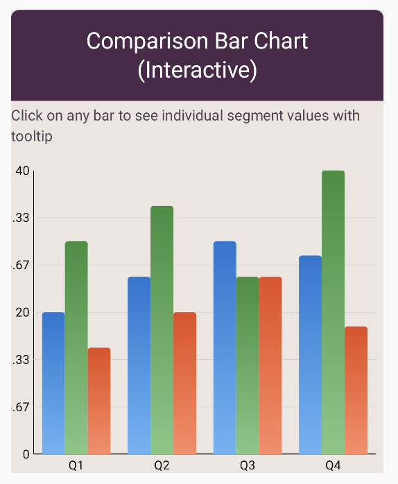

# Comparison Bar Chart

A comparison bar chart (also known as a grouped bar chart) displays multiple data series side-by-side for each category.
This layout is ideal for comparing sub-categories, different metrics, or multiple time periods within each main category,
making it easy to spot patterns and differences across groups.

## Preview



## Use cases

- Comparing multiple products, regions, or segments across the same categories.
- Showing before/after comparisons or year-over-year changes.
- Benchmarking actual vs. target values for multiple categories.
- Displaying survey responses from different demographic groups.

## Configuration

Comparison bar charts use `BarChartConfig` with additional grouping settings.

Key options include:

- `barWidthFraction`: Controls the width of individual bars and spacing between groups.
- `groupSpacing`: Adjusts space between grouped bar sets.
- Colors: Provide one color per series; use consistent colors to help users track series across categories.
- Animation: Animate bars entering or updating.

See also:

- [Bar chart configuration](../configurations/bar-chart-config.md)
- [Chart scaffold configuration](../configurations/chart-scaffold-config.md)

## Code examples

```kotlin
ComparisonBarChart(
    data = {
        listOf(
            BarGroup("Q1", listOf(45f, 52f)),
            BarGroup("Q2", listOf(58f, 63f)),
            BarGroup("Q3", listOf(72f, 68f)),
        )
    },
    colors = ChartyColor.Gradient(
        listOf(Color(0xFFE91E63), Color(0xFF2196F3))
    ),
)
```

### Three-series comparison

```kotlin
ComparisonBarChart(
    data = {
        listOf(
            BarGroup("Product A", listOf(40f, 50f, 45f)),
            BarGroup("Product B", listOf(55f, 60f, 52f)),
            BarGroup("Product C", listOf(65f, 58f, 70f)),
        )
    },
    colors = ChartyColor.Gradient(
        listOf(Color.Red, Color.Blue, Color.Green)
    ),
    barConfig = BarChartConfig(
        barWidthFraction = 0.8f,
        cornerRadius = CornerRadius.Medium,
    ),
)
```

## Tips

- Limit the number of series per group to 2-4 for clarity; more becomes hard to read.
- Use a clear legend to identify what each color/series represents.
- Ensure each series uses a distinct, accessible color.
- Sort categories by one of the series to make trends easier to spot.
- Consider using a **Stacked Bar Chart** if you need to show totals as well as components.

## Related charts

- [Bar Chart](bar-chart.md)
- [Stacked Bar Chart](stacked-bar-chart.md)
- [Combo Bar Chart](combo-bar-chart.md)
- [Bar Charts Overview](bar-charts.md)

