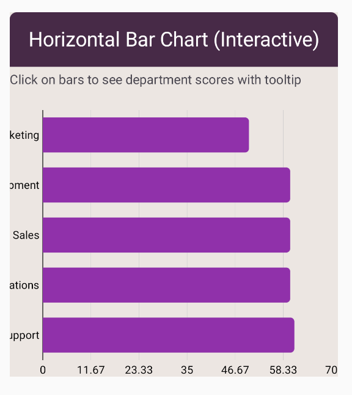

# Horizontal Bar Chart

A horizontal bar chart presents categorical data with horizontal rectangular bars, where the length of each bar is proportional to the value it represents.
This type of chart is particularly useful for comparing categories with long labels or when there are many categories to display.

## Usage

```kotlin
HorizontalBarChart(
    data = {
        listOf(
            BarData("Category A", 100f),
            BarData("Category B", 150f),
            BarData("Category C", 120f)
        )
    },
    color = ChartyColor.Solid(Color(0xFF2196F3)),
    barConfig = BarChartConfig(
        barWidthFraction = 0.6f,
        cornerRadius = CornerRadius.Large
    )
)
```
