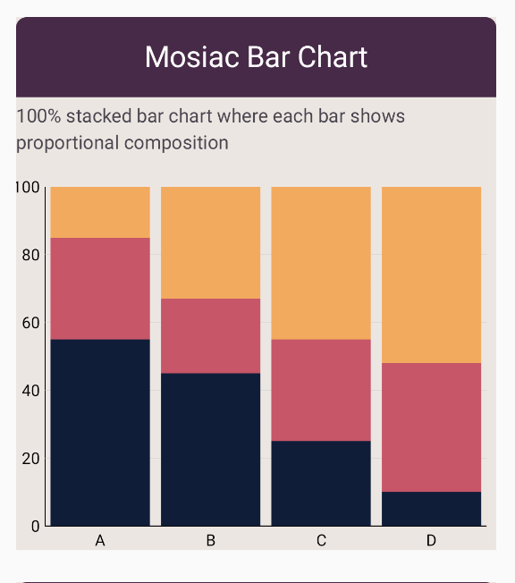

# Mosiac Bar Chart

Mosiac Bar Chart - 100% stacked bar chart.

Each bar represents a category whose segments are normalized to 100% of
the bar height, similar to a mosaic / 100% stacked bar chart.

## Usage

```kotlin
// Example usage
MosiacBarChart(
    data = {
        // ... list of bar groups
    },
    // ... other parameters
)
```
