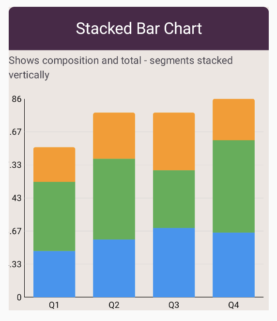

# Stacked Bar Chart

Stacked Bar Chart - Display data as stacked vertical bars showing composition

A stacked bar chart shows multiple values stacked on top of each other,
displaying both individual values and the total. Useful for showing part-to-whole
relationships and composition over categories.

## Usage

```kotlin
StackedBarChart(
    data = {
        listOf(
            BarGroup("Q1", listOf(20f, 30f, 15f)),
            BarGroup("Q2", listOf(25f, 35f, 20f)),
            BarGroup("Q3", listOf(30f, 25f, 25f))
        )
    },
    colors = ChartyColors.DefaultGradient,
    stackedConfig = StackedBarChartConfig(
        barWidthFraction = 0.7f,
        topCornerRadius = CornerRadius.Medium
    )
)
```
