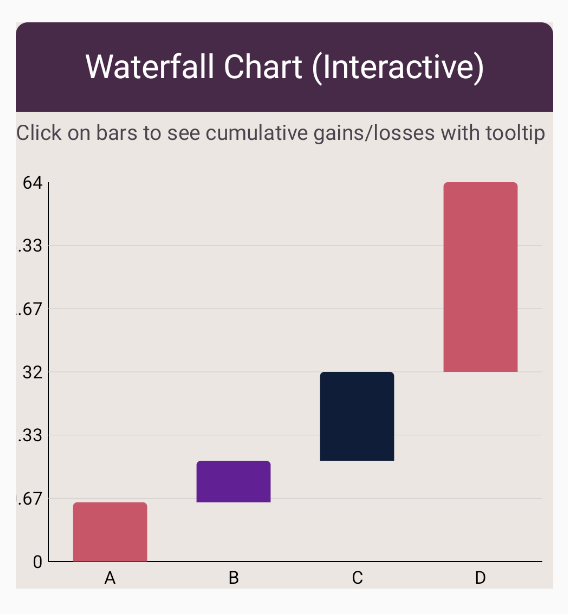

# Waterfall Chart

Waterfall Chart - visualizes cumulative effect of sequential gains/losses.

## Usage

```kotlin
// Example usage
WaterfallChart(
    data = {
        // ... list of bar data
    },
    // ... other parameters
)
```
