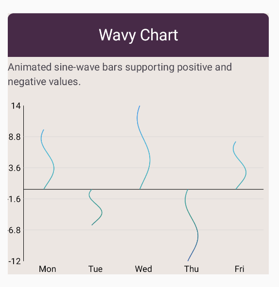

# Wavy Chart

A wavy chart renders each data entry as a vertical "bar" whose outline is a continuously animating sine wave,
creating a fluid, dynamic appearance instead of solid rectangles. All bars animate in sync or with optional
per-bar phase offsets, producing a rhythmic wave motion that adds personality to your visualizations.

## Preview



## Use cases

- Creating eye-catching, playful dashboards for consumer-facing apps.
- Visualizing audio levels, sound waves, or rhythmic data.
- Adding dynamic, animated elements to presentations and demos.
- Displaying data in creative or artistic contexts where standard charts feel too rigid.

## Configuration

Wavy charts use configuration options for wave animation and appearance.

Key options include:

- `amplitude`: Controls how much the wave oscillates from the bar centerline.
- `frequency`: Sets how many wave cycles appear along the bar height.
- `animationSpeed`: Adjusts how fast the wave animates.
- `barWidthFraction`: Controls the width of each wavy bar.
- Colors: Use solid colors or gradients for the wave fill.

See also:

- [Bar chart configuration](../configurations/bar-chart-config.md)
- [Animation customization](../customization/animations.md)
- [Chart scaffold configuration](../configurations/chart-scaffold-config.md)

## Code examples

```kotlin
WavyChart(
    data = {
        listOf(
            BarData("A", 80f),
            BarData("B", 120f),
            BarData("C", 90f),
        )
    },
    color = ChartyColor.Solid(Color(0xFF00BCD4)),
    wavyConfig = WavyChartConfig(
        amplitude = 8f,
        frequency = 2f,
        animationSpeed = 1.5f,
        barWidthFraction = 0.6f,
    ),
)
```

### Multi-color wavy bars

```kotlin
WavyChart(
    data = { audioLevels },
    color = ChartyColor.Gradient(
        listOf(Color(0xFFFF6B6B), Color(0xFF4ECDC4), Color(0xFF45B7D1))
    ),
    wavyConfig = WavyChartConfig(
        amplitude = 10f,
        frequency = 3f,
    ),
)
```

## Tips

- Keep amplitude and frequency moderate to avoid visual clutter.
- Use subtle animation speeds for professional dashboards; faster speeds for playful contexts.
- Ensure good contrast between wave color and background.
- Consider accessibility; provide static alternatives or disable animations for users with motion sensitivity.
- Test performance on lower-end devices, as continuous animation can be resource-intensive.

## Related charts

- [Bar Chart](bar-chart.md)
- [Bubble Bar Chart](bubble-bar-chart.md)
- [Lollipop Bar Chart](lollipop-bar-chart.md)
- [Bar Charts Overview](bar-charts.md)

